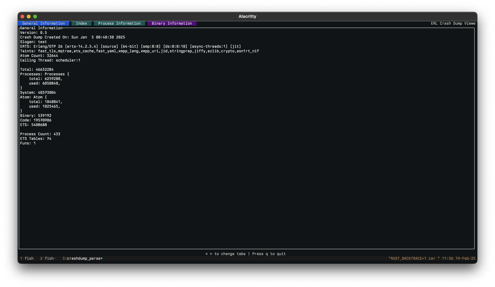
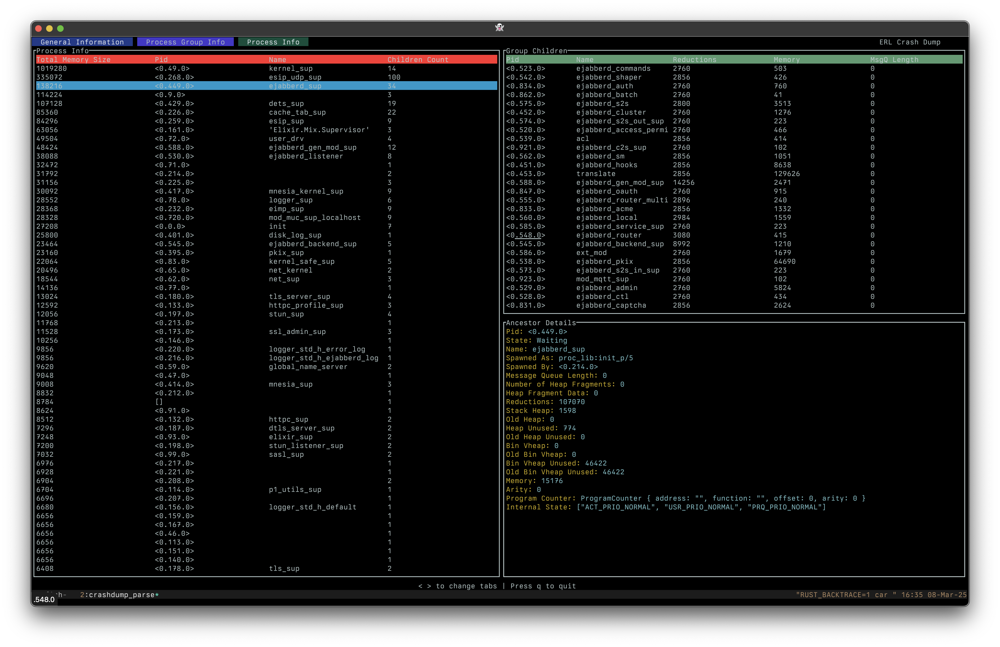
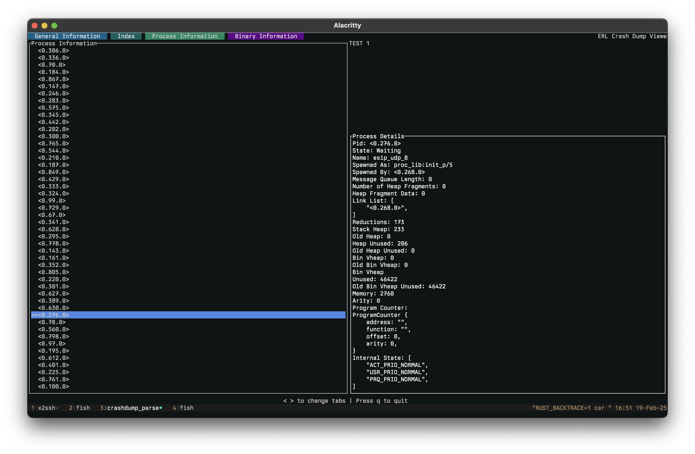

# (Beta) CLI for viewing Erlang Crash Dumps
[](https://github.com/WhatsApp/crashdump_viewer_cli/actions/workflows/rust.yml)

View your crash dumps without wxwidgets.

## Examples
```
cargo run sample_dumps/erl_crash_20250105-004018.dump
```

shows








## Building Crash Dump Viewer CLI
```
cargo build
```

See the [CONTRIBUTING](CONTRIBUTING.md) file for how to help out.

## TODOs
- [x] - Implement Message Queue Parsing
- [] - Implement Help Page (when you press `?`, should come up with a list of commands)
- [] - Parallelize `CrashDump::from_index_map`
- [] - Better colorized output for processes
- [] - Implement additional information (when you press enter, we should be able to go into the children table)
- [] - Human readable byte sizes (should be in bytes instead of words)
- [] - Better coloring that just static coloring (we're currently hardcoding a lot of colors, but these should ideally be moved out)
- [] - Implement a regex search for processes
- [] - Implement common lifetime and scheme for `CrashDump`
- [] - Cleanup unwraps()
- [] - Split `app.rs` properly into `tui.rs`
- [] - Refactor `Parser`

## License
Crash Dump Viewer CLI is Apache 2.0 licensed, as found in the LICENSE file.
