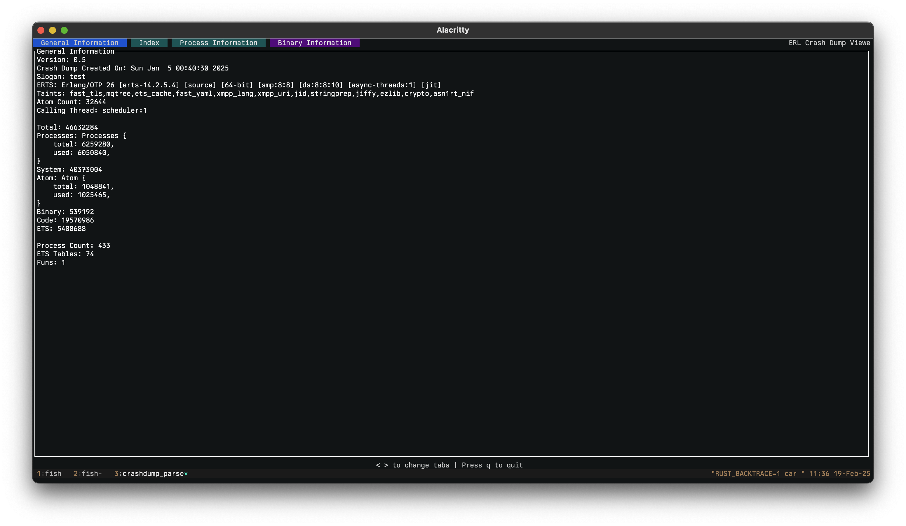
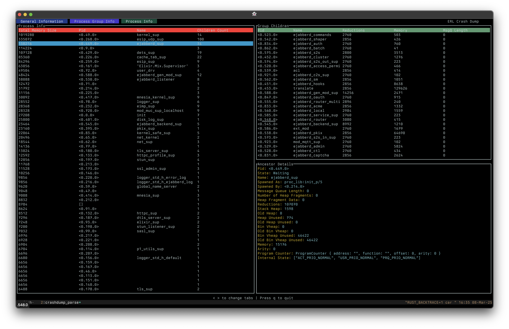
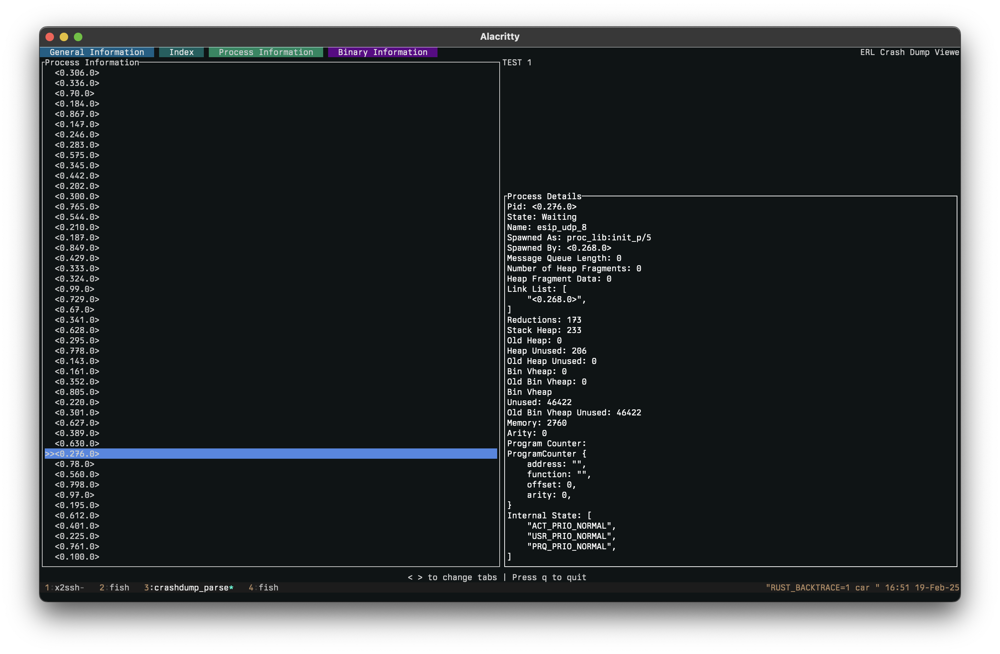

# (Beta) Erlang Crash Dump Viewer CLI

[](https://github.com/WhatsApp/crashdump_viewer_cli/actions/workflows/rust.yml)

This CLI tool allows you to view Erlang crash dumps without requiring wxWidgets. While it shares the purpose of the [official crash dump viewer](https://www.erlang.org/doc/apps/observer/crashdump_ug.html), it offers several key advantages:

* **Platform Independence:** No wxWidgets dependency, enabling use over SSH or in environments without graphical interfaces.
* **Process Ancestor Grouping:** Presents a "Processes Group" view, organizing processes by their named ancestor (the closest parent process in the hierarchy that has a user-defined name). This simplifies understanding complex process hierarchies. See `CDParser::create_descendants_table` function.
* **Memory Address Decoding:** Decodes stack, heap, and message queue addresses, providing detailed insights into process memory.
* **Memory Efficiency:** Unlike the official crash dump viewer, this CLI tool does not attempt to load the entire crash dump into memory, enabling analysis of very large dumps.

**Note:** This is a beta release, and some features are still under development. We encourage you to try it and provide feedback. See the TODO list below for planned enhancements.

## Demo
[](https://asciinema.org/a/v0rMrLzXdTR8WSOHr0h85XWl5)

## Examples

### TUI Mode (Interactive Interface)
```
cargo run sample_dumps/erl_crash_20250105-004018.dump
```

This launches the interactive TUI with:
- **General Information** tab: View crash dump metadata and memory information
- **Process Group Info** tab: View processes grouped by their named ancestors
- **Process Info** tab: View all processes with detailed memory metrics
  - Press `S` to view stack, `H` for heap, `M` for message queue
  - Press `I` to inspect in fullscreen mode
  - Use `/` to search for processes by PID or name (regex supported)
  - Use `PageUp`/`PageDown` or `b`/`f` to navigate quickly
- **Inspector** tab: Fullscreen view of stack/heap/message queue
- **Analysis** tab: Run various analyses on the crash dump
  - Press `M` for memory analysis (top 10 processes by memory metrics)
  - Press `P` to analyze the currently selected process
  - Press `R` to show all registered processes

### CLI Analysis Modes

Analyze memory usage and show top processes:
```
cargo run -- --action=analyze --mode=memory --arg=10 sample_dumps/erl_crash.dump
```

Analyze a specific process (by PID or name):
```
cargo run -- --action=analyze --mode=process --arg="<0.96.0>" sample_dumps/erl_crash.dump
cargo run -- --action=analyze --mode=process --arg="wa_system_monitor" sample_dumps/erl_crash.dump
```

Show all registered processes:
```
cargo run -- --action=analyze --mode=registered sample_dumps/erl_crash.dump
```

Analyze context-specific processes (logging, metrics, monitoring):
```
cargo run -- --action=analyze --mode=context sample_dumps/erl_crash.dump
```

Deep dive analysis of all processes:
```
cargo run -- --action=analyze --mode=all sample_dumps/erl_crash.dump
```

shows








## Building Crash Dump Viewer CLI
```
cargo build
```

See the [CONTRIBUTING](CONTRIBUTING.md) file for how to help out.

## Features Available
- [x] - Stack, heap, message queue parsing per process
- [x] - Process ancestor grouping
- [x] - Viewing individual information for a process
- [x] - Page up/down navigation in tables
- [x] - Regex search for processes (by PID or name)
- [x] - CLI analysis modes (memory, process, registered, context, all)

## TODOs
### High Priority
- [x] - Parallelize `CrashDump::from_index_map`
- [x] - Add TextView to inspect all output on Stack/Heap/Messages
    - [x] - Implement additional information (when you press enter, we should be able to go into the children table)
- [x] - Human readable byte sizes (should be in bytes instead of words)

### Future Work
- [x] - Implement Help Page (when you press `?`, should come up with a list of commands)
- [x] - Better coloring that just static coloring (we're currently hardcoding a lot of colors, but these should ideally be moved out)
- [x] - Implement custom sorting for tables
- [x] - Implement a regex search for processes (current right now you can't search, only scroll down)
- [x] - Implement page up/down for tables
- [x] - Implement CLI analysis modes (similar to Python crash_dump_analyzer)
- [ ] - Implement common lifetime and scheme for `CrashDump`
- [ ] - Cleanup unwraps()
- [ ] - Split `app.rs` properly into `tui.rs`
- [ ] - Refactor `Parser`
- [ ] - Implement JSON mode

## License
Crash Dump Viewer CLI is Apache 2.0 licensed, as found in the LICENSE file.
