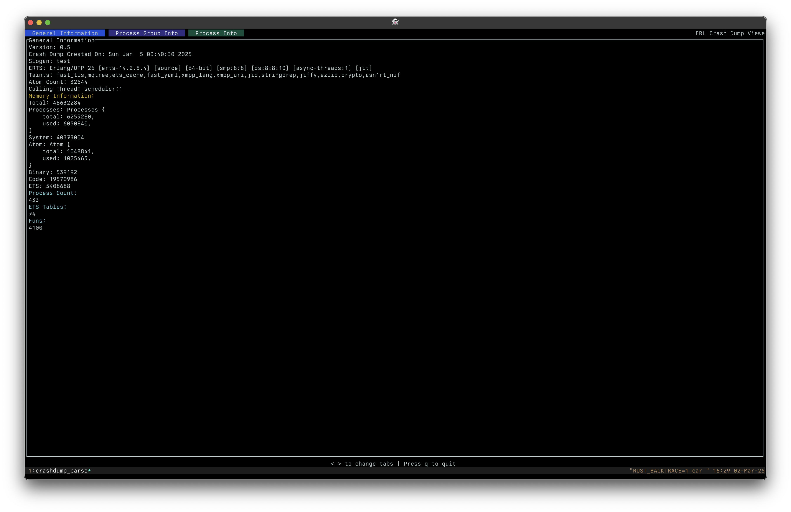

# CLI for viewing Erlang Crash Dumps
View your crash dumps without wxwidgets.

## Examples
```
cargo run sample_dumps/erl_crash_20250105-004018.dump
```

shows




## Building Crash Dump Viewer CLI
```
cargo build
```

See the [CONTRIBUTING](CONTRIBUTING.md) file for how to help out.

## License
Crash Dump Viewer CLI is Apache 2.0 licensed, as found in the LICENSE file.
