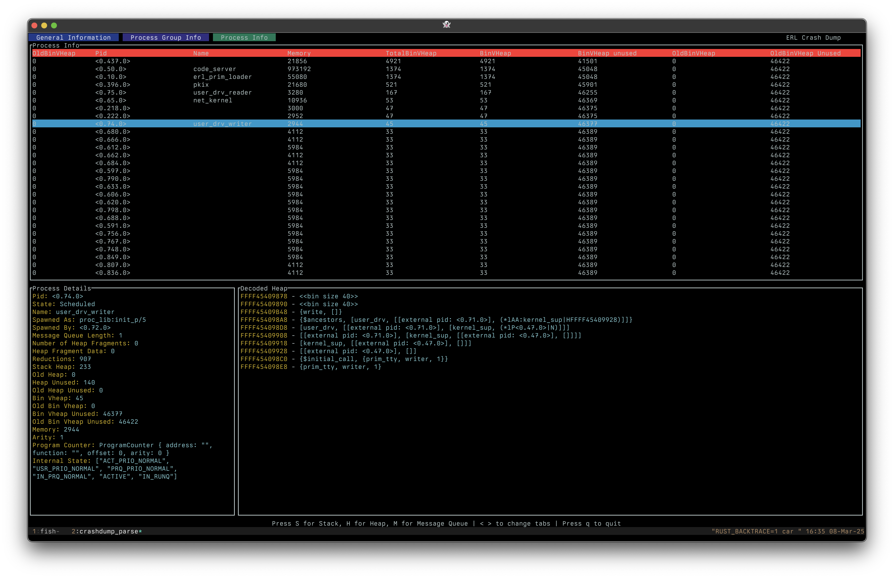

# (Beta) Erlang Crash Dump Viewer CLI

[](https://github.com/WhatsApp/crashdump_viewer_cli/actions/workflows/rust.yml)

This CLI tool allows you to view Erlang crash dumps without requiring wxWidgets. While it shares the purpose of the [official crash dump viewer](https://www.erlang.org/doc/apps/observer/crashdump_ug.html), it offers several key advantages:

* **Platform Independence:** No wxWidgets dependency, enabling use over SSH or in environments without graphical interfaces.
* **Process Ancestor Grouping:** Presents a "Processes Group" view, organizing processes by their named ancestor (the closest parent process in the hierarchy that has a user-defined name). This simplifies understanding complex process hierarchies. See `CDParser::create_descendants_table` function. 
* **Memory Address Decoding:** Decodes stack, heap, and message queue addresses, providing detailed insights into process memory.
* **Memory Efficiency:** Unlike the official crash dump viewer, this CLI tool does not attempt to load the entire crash dump into memory, enabling analysis of very large dumps.

**Note:** This is a beta release, and some features are still under development. We encourage you to try it and provide feedback. See the TODO list below for planned enhancements.

## Examples
```
cargo run sample_dumps/erl_crash_20250105-004018.dump
```

shows





## Building Crash Dump Viewer CLI
```
cargo build
```

See the [CONTRIBUTING](CONTRIBUTING.md) file for how to help out.

## Features Available
- [x] - Stack, heap, message queue parsing per process
- [x] - Process ancestor grouping
- [x] - Viewing individual information for a process

## TODOs
### High Priority
- [ ] - Parallelize `CrashDump::from_index_map`
- [ ] - Add TextView to inspect all output on Stack/Heap/Messages
    - [ ] - Implement additional information (when you press enter, we should be able to go into the children table)
- [ ] - Human readable byte sizes (should be in bytes instead of words)

### Future Work
- [ ] - Implement Help Page (when you press `?`, should come up with a list of commands)
- [ ] - Better coloring that just static coloring (we're currently hardcoding a lot of colors, but these should ideally be moved out)
- [ ] - Implement custom sorting for tables 
- [ ] - Implement a regex search for processes (current right now you can't search, only scroll down)
- [ ] - Implement page up/down for tables
- [ ] - Implement common lifetime and scheme for `CrashDump`
- [ ] - Cleanup unwraps()
- [ ] - Split `app.rs` properly into `tui.rs`
- [ ] - Refactor `Parser`
- [ ] - Implement JSON mode 

## License
Crash Dump Viewer CLI is Apache 2.0 licensed, as found in the LICENSE file.
